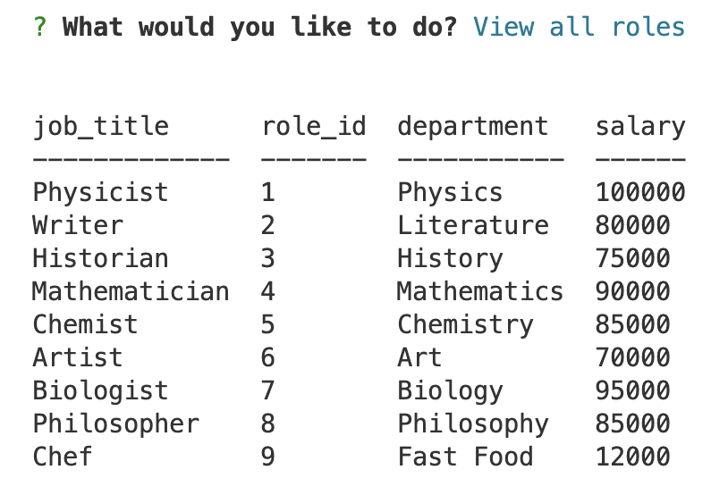
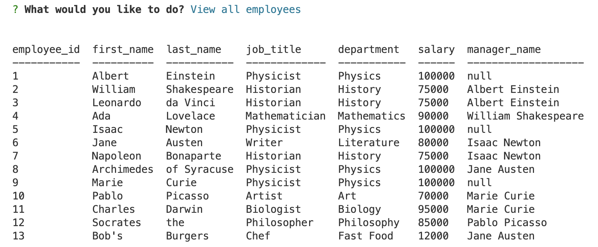
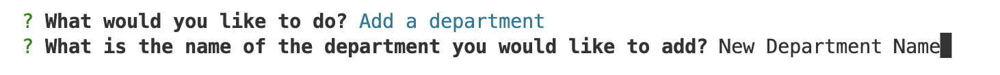
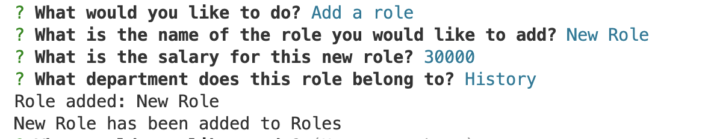
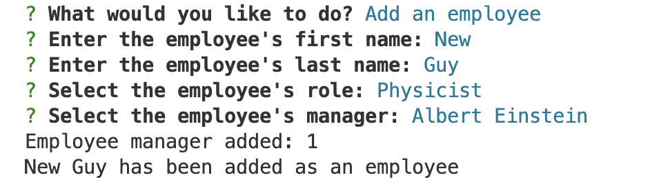
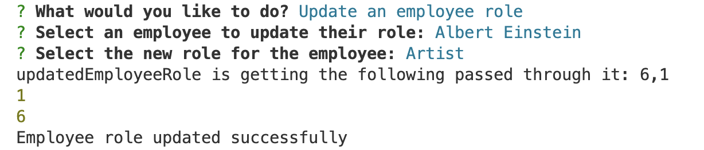

# Note Taker Application

 

 

A link to a working demo of note taker can be found [here](https://drive.google.com/file/d/1fTGKFns4EIoMkdz8mXcEcXuX-J-oKXpL/view).

## Description
#### Motivation:
The driving force behind developing this app was to simplify and streamline the process of managing databases, giving users better control over their data.

#### Why Build:
This app was created to provide users with an intuitive tool for tracking personnel activities. By offering features like salary categorization, the app empowers managers to make financially informed hiring decisions. 

#### Problem Solved:
The app addresses the challenge of managing personnel effectively by offering a centralized platform for recording changes and identifying data surrounding each employee.

#### What Was Learned:
Through the development of this app, valuable insights were gained into user-centric design principles and the importance of creating a seamless user experience. Additionally, I gained technical proficiency with SQL, database management, node, inquirer, exporting modules, and using dotenv.

## Table of Contents
  * [Installation](#installation)
  * [Usage](#usage)
  * [Credits](#credits)
  * [License](#license)
  * [Badges](#badges)
  * [Features](#features)
  * [How to Contribute](#how-to-contribute)

## Installation Instructions
#### Step 1:
Ensure you have Node.js installed on your computer.

#### Step 2:
Clone this GitHub repository to your local machine using git clone.

#### Step 3:
Navigate to the root directory of the project in the terminal.

#### Step 4:
Install the required dependencies by running npm install.

## Usage
#### Example 1:
Once you have installed the necessary dependencies, you can run the Employee Tracker application by executing the following command in the terminal: npm start

#### Example 2:
You will see a terminal prompt that will ask you what you'd like to do. Select from the prompt to view all departments, view all roles, view all employees, add a department, add a role, add an employee, or update an employee role.

#### Example 3:
Follow the follow-on prompts answering additional questions.

## Credits
#### Individual Credits:
  * I worked with an AskBCS representative, @yojeil. He suggested I break up the prompts. While I didn't take that suggestion, I understand the direction. 
  * I also worked with @smaharaj, who confirmed my assumption on what the problem and fix were. 
  * ChatGPT supported with general back and forth dialogue to better understand concepts and problem solve. 

#### Tutorials Followed:

  * https://github.com/SBoudrias/Inquirer.js
  * https://dev.mysql.com/doc
  * https://chat.openai.com

## License
MIT License

## Badges
  * 

  *  
  
  *  

## Features
  * view all departments
  
  * view all roles
  
  * view all employees
  
  * add a department
  
  * add a role
  
  * add an employee
  
  * update an employee role
  

## How to Contribute
Contributions to the Employee Tracker application are encouraged and can be made by forking the repository on GitHub, creating a new branch, making changes to enhance functionality, and submitting a pull request. The maintainers will review the changes, provide feedback if needed, and merge approved contributions into the main branch. This collaborative process allows contributors to actively improve the Note Taker application and make it more valuable for users.

## Questions 
If you have any questions about the content, instructions, or how to get involved in this project, please contact: 

  * Jimmy O'Brien    
    GitHub Username: [jimmyjr77](https://github.com/jimmyjr77/)    
    Email Address: jimmyjr.obrien@gmail.com    